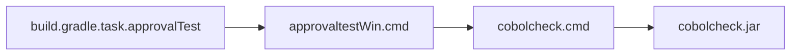
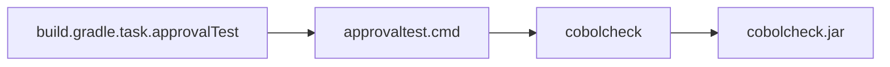

# Approval Testing Documentation
version 0.9 - not final yet...
To use this setup, the verifyAction must be updated.

## Approval Test Flow
Approval testing verifies that the output of code matches an approved reference. The typical flow is:

1. Run the approval tests.
2. The test generates and output file based on the current code.
3. The output is compared to a previously approved file.
4. If the output matches, the test passes.
5. If there are differences, the test fails and highlights the changes.
6. Review the differences. If correct, approve the new output by replacing the approved file.
7. Commit the updated approved files to version control.

This process helps ensure that changes to code are intentional and reviewed.

## Gradle Task and Used Files
The approval tests are run using a custom Gradle task defined in build.gradle. 
This task executes the approval test script, which generates output files for comparison.  

**Key files:**  
- ```build.gradle```: Contains the configuration and task for running approval tests. 
- ```src/test/approvalTest/approvaltest```: The main script for running approval tests (use ```approvaltestWin.cmd``` on Windows).
- ```src/test/approvalTest/received/```: Directory where test output files are generated.
- ```src/test/approvalTest/approved/```: Directory containing the approved reference files.
- ```src/test/approvalTest/readme.md```: Documentation for the approval test flow.

The Gradle task automates running the approval test script and manages the comparison between received and approved files. 
If differences are found, you can review and update the approved files as needed.

## Workings
1. Developer maintains the code and the approved file that resides under ```src/test/approvalTest/```.
2. When (the developer runs gradle or) the Gradle task executes, files are copied to ```build/approvalTest/```. During this process, the jar version is injected into the script.
3. The script generates a new output file in the ```build/approvalTest/``` directory.

## Script connections
### Windows



### Linux


## To do
- [ ] Make it clear what tests are to be performed. developer must be able to remove/add tests easily
- [ ] Split the cobol-check script into smaller parts to handle one test at a time and compare results 1:1
- [ ] Improve the script to handle more dynamic scenarios for the developer
- [ ] Finalize version 1.0
